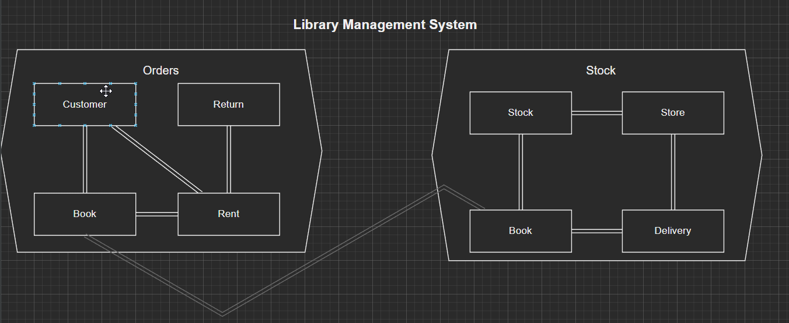

<h1> Library management system </h1>

This project is initialised as a code kata to learn domain driven design.
it is written in Laravel 10 
and runs in php 8.3

We have a order system and a stock system. The order system is responsible for the following actions:
- A customer can rent a book for a certain period
- A customer can return a rented book.
- on purpose left out (for the time being):
  - If a book is not returned back in-time, what do we do then? 
  - 

And the stock system can do the following actions:
- Add books to the store from the delivery company
- Add identical books to the stock
- Delete books from the store if there were any in the stock
- The store should have a maximum of three books on the shelves at all times.
- The stock can have a maximum of 5 books in the back. (which makes a total of 8 books combined: Stock and Store)

Initial challanges: 
- How do I tackle the shared book aggregate root entity?
- If i publish order domain events, how do I consume those in the stock domain?
