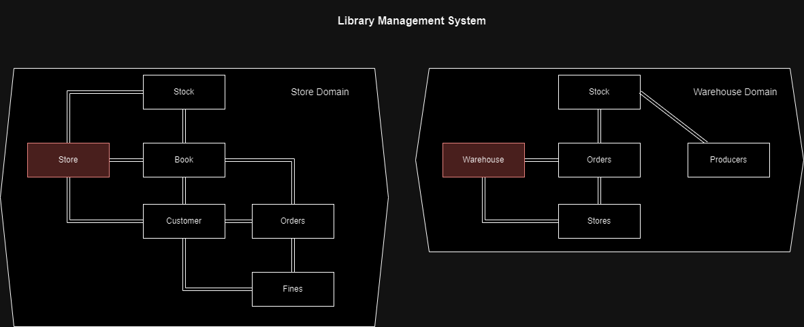

<h1> Library management system </h1>

This project is initialised as a code kata to learn domain driven design.
it is written in Laravel 10 
and runs in php 8.3

### Acceptance Criteria
We have a order system and a stock system. The order system is responsible for the following actions:
- A customer can rent a book for a certain period which creates an order.
- A customer can return a rented book if that rented book is his own book.
- If a customer has not returned the book within the time range, he gets fined a dollar foreach week he did not return it.
- We want to notify the customer each week another dollar has been added to his order.
- If the stock of the shop is full, we want to return 3 books of that title, of another one of that book then returns just only add 1 (so 4).
- The shop should have a maximum of 8 books in total in the stock.
- The warehouse drives by only once a week to retrieve all the books that have been pilled up on the counter of the shop.

And the warehouse system can do the following actions:
- Can receive orders from the shop to provide the shop with books.
- Can buy wholesale orders at producers in bulk at 50 at a time.
- Retrieves books from the shop to re-sell again at other shops.

## OUTDATED:

## Initial challanges: 
- How do I tackle the shared book aggregate root entity?
  - Also you don't, dont have shared aggregate roots.
- If i publish order domain events, how do I consume those in the stock domain?
  - a: You don't! keep domain events within your own domain.

## issues i encountered:
- Concurrency issue, try to prevent to update two domains on one action.
- Domain events vs integration events
- Conflict of interests in a single domain (customer info in the stock domain) See the commit on 14-01-2024

## Diary:
12-01-2024
After implementing the code, the two questions were answered by creating the models.
I made a simple EventBus class which is re-registered after registering the subscriber events to the eventbus. To mimic an singleton.
And for the first question, thats not necessary, just create two roots as book in the two bounded contexts.

14-01-2024
After another day of work i realised the two bounded contexts are designed incorrectly.
I discovered that after i noticed an concurrency issue that could have been solved with complex error handling or locking the database per transaction.
The concurrency issue was: what if two customers rents two of the same books that only have one stock in quantity left? 
The way how I resolved that now is that a stock is responsible for publishing an event: BookStockReducedEvent and imidiatly saves that(the reduction) action which causes a Order to be created.
Which sounds to me that we have some conflicts of interested. Because the Stock domain shouldnt know anything about customer information, but it must because of the publication of the Order to be created.

I am currently redesigning the two bounded contexts to a separate 
`Shop domain` and `Warehouse Domain`.
So that a warehouse is responsible for filling up the shop.
and a shop has it's own small stock.

Refactored version:

